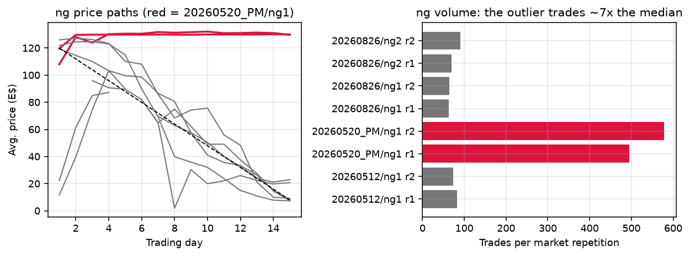
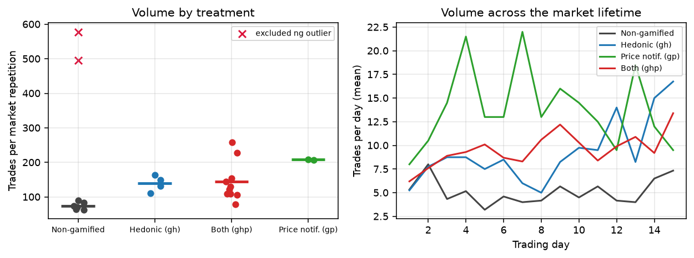
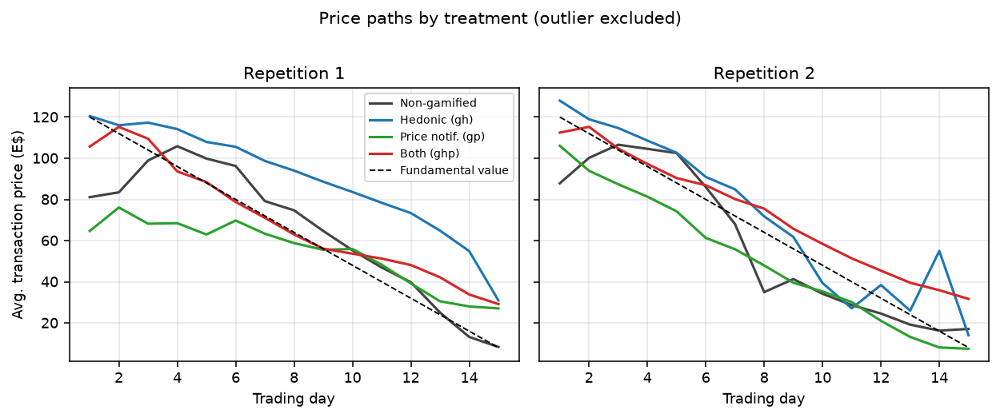
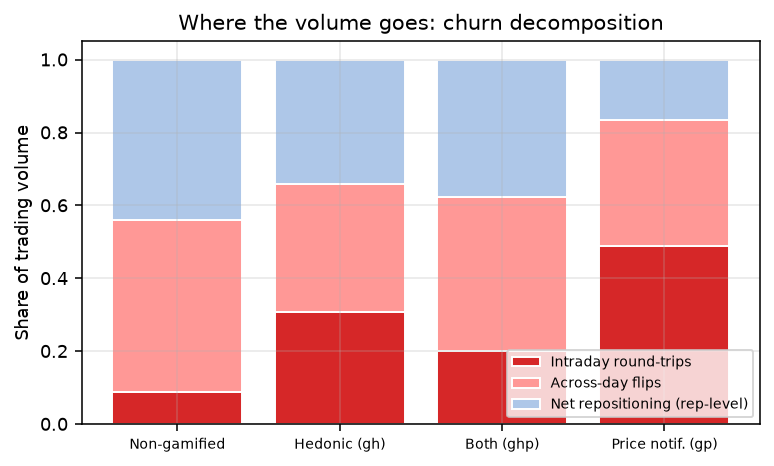
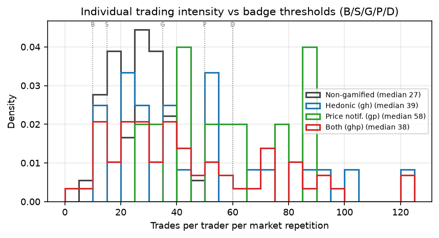
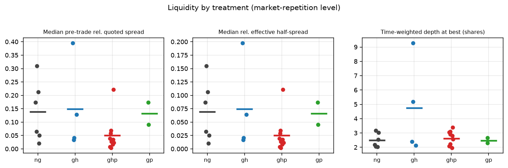

# Gamification, volume, and liquidity: mechanism report

*Scratch analysis (`src/explore/agent_v2/`) — reproducible via
`python3 src/explore/agent_v2/volume_liquidity_mechanisms.py`. All numbers in
`mech_results.json`; per market-repetition metrics in `market_rep_metrics.csv`.*

**Question set.** (1) Isolate the outlier ng group. (2) Verify the working
hypothesis that gamified treatments trade much more while price / mispricing /
bubble effects are modest. (3) Trace the mechanisms: where does the extra
volume go, how is liquidity affected, and is there more churn?

**Statistical unit and power.** The independent unit is the participant group
(6 subjects, two 15-period market repetitions). After excluding the outlier
the sample is 11 groups: 3 ng, 2 gh, 1 gp, 5 ghp (22 market repetitions,
verified 1:1 against the raw order-level data). Headline tests are two-sided
Mann-Whitney U on group means, 8 gamified vs 3 ng; the strongest attainable
two-sided p-value is 2/165 ≈ 0.012. Effect sizes matter more than stars here.

---

## 1. Executive summary

1. **The outlier is `20260520_PM/ng1`** (one of the two ng groups run on
   May 20 PM). It traded 495 and 578 times in its two repetitions — ~7× the
   ng median of 158 total — and its average price stayed pinned at ~130 E$
   through period 15 (fundamental value 8), giving absolute mispricing ratios
   of ~2.6 in both repetitions. It is excluded everywhere below; including it
   would *reverse* the volume ranking (ng mean 190 > gamified 151, p = 0.21)
   and roughly double measured ng mispricing.
2. **The working hypothesis is broadly confirmed, with one honest nuance.**
   Volume roughly **doubles** under gamification (151 vs 74 trades per
   repetition, p = 0.012 — perfect rank separation). Mispricing point
   estimates are *directionally* higher (RAD +31%, bubble flags 0.75 vs 0.17
   per repetition) but nowhere near significant (p ≥ 0.38) and are dwarfed by
   within-treatment heterogeneity: the two gh groups alone span RAD 0.04–0.55.
   "Minimal impact" is accurate as a statistical statement; "no impact" would
   overstate it — the sample cannot rule out moderate positive effects.
3. **The extra volume is churn, not repositioning.** Decomposing each
   trader's gross volume: intraday round-trips absorb 26% of gamified volume
   vs 9% of ng volume; rep-level net repositioning accounts for only 34% of
   gamified volume vs 44% of ng. In levels, net-repositioning trades are
   nearly identical across arms (~33–49 per repetition); intraday round-trip
   trades go from ~7 (ng) to 33–102 (gamified).
4. **Liquidity does not deteriorate — if anything it improves.** Pre-trade
   relative quoted spreads (median 0.085 vs 0.139), effective half-spreads
   (0.043 vs 0.069), and per-trade price impact (0.016 vs 0.030) are all
   *lower* in gamified markets, with similar depth at best and slightly more
   two-sided books. None of these clear significance individually, but every
   liquidity point estimate leans the same way.
5. **Why prices barely move despite 2× volume:** gamified order flow is
   *balanced*. The mean daily aggressor imbalance is 0.42 in gamified markets
   vs 0.74 in ng — perfect group-level separation, p = 0.012. Gamified
   traders fire buys and sells that offset within the day (hot-potato trading
   between the same pairs rises from 39% to 52% of trades), so the extra
   volume recycles inventory instead of exerting directional price pressure,
   and the added two-sided flow keeps the book tight.

---

## 2. Data notes and quality flags

- **Sample map.** 4 included sessions → 12 groups; `20260520_PM/ng1`
  excluded → 11 groups / 22 market repetitions. Trade counts in the processed
  panels match the raw MBO event stream exactly for all 22.
- **Pipeline bug (action item).** `market_day_panel_full.csv` and
  `trader_day_panel_full.csv` code `gamified = 0` for the **gh and gp arms**,
  because `process_session.py` sets
  `gamified = (group.market_design == "gamified")` while the raw values are
  `hedonic_only` / `info_only` / `gamified` / `non_gamified`. Any analysis
  using the panel's `gamified` column pools gh and gp with the controls. This
  report re-derives all treatment dummies from the `treatment` label. The
  `hedonic` and `price_notifications` dummies are correct.
- **Cumulative exports (handle with care).** The oTree custom exports are
  cumulative database dumps: `20260520_AM`'s MBO file contains all nine
  `20260512` markets. Naive concatenation double-counts; rows are assigned to
  their own lab session here.
- All orders and trades have unit size, so trade counts equal share volume;
  turnover below is trades / 90 shares outstanding.

## 3. The outlier: `20260520_PM/ng1`

| | Rep 1 | Rep 2 | Clean ng range (total per group) |
|---|---|---|---|
| Trades | 495 | 578 | 127–160 |
| Abs. mispricing ratio | 2.59 | 2.61 | 0.14–0.44 |
| Peak avg. price | 130.2 | 132.1 | — |

The group's average price never converges: it sits at ~130 E$ from period 1
to period 15 in **both** repetitions — a flat price path against a fundamental
value declining from 120 to 8, sustained by ~500 trades per repetition. No
other market in any arm looks remotely like this (next-highest volume is 258).
Whatever the cause (a coordinating/confused group; worth checking the session
log and chat notes), it is 7× the ng median on volume and ~10× on mispricing,
and it flips the sign of the volume treatment effect if kept. Isolating it is
the right call; report it in the paper's exclusions note.

## 4. Claim check: volume vs price effects

Group-level means (outlier excluded), Mann-Whitney gamified (n=8) vs ng (n=3):

| Metric (per market repetition) | ng | gh | gp | ghp | Gamified | Ratio | p |
|---|---|---|---|---|---|---|---|
| Trades | 74 | 139 | 208 | 144 | **151** | **2.04** | **0.012** |
| Turnover (× shares outstanding) | 0.82 | 1.54 | 2.31 | 1.60 | 1.68 | 2.04 | 0.012 |
| RAD (Stöckl et al. 2010) | 0.216 | 0.295 | 0.241 | 0.287 | 0.283 | 1.31 | 0.630 |
| RD (signed) | −0.041 | 0.266 | −0.177 | 0.109 | 0.113 | — | 0.376 |
| Abs. mispricing (E$) | 14.3 | 19.9 | 15.9 | 18.6 | 18.6 | 1.30 | 0.630 |
| Abs. mispricing ratio | 0.263 | 0.621 | 0.331 | 0.555 | 0.544 | 2.07 | 0.776 |
| Bubble periods (2σ flag) | 0.17 | 0.75 | 0.00 | 0.90 | 0.75 | 4.5 | 0.435 |
| Surges + crashes | 0.50 | 0.25 | 0.50 | 0.50 | 0.44 | 0.88 | ~0.5 |

**Verdict.** The volume effect (H2) is large, consistent (every gamified
group out-trades every clean ng group), and as significant as this design can
deliver. The price-discovery effects (H1) are directionally positive on most
measures but statistically indistinguishable from zero, and the honest headline
number is RAD +31% with a group-level p of 0.63. Two important nuances:

- The seemingly large AMR ratio (2.07×) is an artifact of AMR's tiny
  end-of-market denominators (FV = 8–24); the denominator-robust RAD puts the
  gap at +31%.
- Heterogeneity within gamified cells is the real story: `20260826/gh1`
  achieved near-perfect pricing (RAD 0.04) while `20260520_AM/gh1` produced a
  textbook bubble (RAD 0.55). Gamification reliably moves *behavior*
  (volume), while its effect on *aggregate price quality* is fragile and
  group-specific. On experience (H1a), RAD falls from repetition 1 to 2 in
  6 of 8 gamified groups and all 3 ng groups; the difference-in-differences is
  not significant here (p = 0.38).

## 5. Where does the extra volume go?

**Churn decomposition.** Each trader-repetition's gross volume splits into
(i) intraday round-trips (buy and sell the same day), (ii) across-day
position flips, and (iii) rep-level net repositioning (the volume actually
needed to move from the initial to the final allocation):

| Trades per repetition | ng | gh | gp | ghp |
|---|---|---|---|---|
| Total | 74 | 139 | 208 | 144 |
| — intraday round-trips | 7 | 41 | 102 | 33 |
| — across-day flips | 34 | 50 | 72 | 62 |
| — net repositioning | 33 | 48 | 35 | 49 |
| Churn ratio (gross / net shares moved) | 2.4 | 3.0 | 6.1 | 3.1 |

Net repositioning is essentially flat across arms — gamified markets do not
reallocate meaningfully more inventory. Nearly all incremental volume is
**recycling**: intraday round-trips rise from 9% of ng volume to 26% of
gamified volume (31% gh, 49% gp), and in gp the churn ratio hits 6.1 sides
per net share moved. Three corroborating patterns:

- **Hot-potato trading.** The share of trades in offsetting buyer–seller
  pairs (A sells to B *and* B sells to A within a repetition) rises from 39%
  (ng) to 52% (gamified).
- **Concentration.** The two most active traders account for 56% of trade
  sides in gamified markets vs 47% in ng (p = 0.024; participation HHI 0.222
  vs 0.189, p = 0.024). The volume boost is not uniform — it is carried by a
  hyperactive minority: the 90th-percentile trader does ~91–126
  trades/repetition in gamified arms vs 37 in ng (medians 38–58 vs 27).
- **Badges bind.** Individual trade counts in hedonic arms pile up at and
  beyond the badge thresholds (silver 15 / gold 35 / platinum 50 / diamond
  60): 57–58% of gh/ghp traders clear gold vs 14% of ng traders. Notably, the
  single gp group (no badges, notifications only) churns hardest of all, so
  alerts nudging action appear at least as volume-inducing as badges — but
  that is one group; do not lean on it.

## 6. Liquidity

Trade-based measures (pre-trade book from the MBP1 feed; effective spread
= aggressor-signed deviation of price from the pre-trade midpoint):

| Metric (market-repetition mean) | ng | gh | gp | ghp | Gamified | p |
|---|---|---|---|---|---|---|
| Median pre-trade rel. quoted spread | 0.139 | 0.149 | 0.132 | 0.050 | 0.085 | 0.376 |
| Median rel. effective half-spread | 0.069 | 0.075 | 0.066 | 0.025 | 0.043 | 0.376 |
| Mean rel. effective half-spread | 0.101 | 0.141 | 0.105 | 0.042 | 0.075 | 0.279 |
| Median per-trade price impact | 0.030 | 0.025 | 0.024 | 0.011 | 0.016 | 0.630 |
| Time-weighted depth at best (shares) | 2.5 | 4.7 | 2.5 | 2.6 | 3.1 | 0.921 |
| Share of time book is two-sided | 0.83 | 0.89 | 0.94 | 0.87 | 0.88 | 0.776 |
| Limit orders submitted | 212 | 344 | 386 | 395 | 381 | 0.085 |
| Orders per trade | 2.9 | 2.4 | 1.9 | 2.7 | 2.5 | 0.776 |
| Cancel share of orders | 0.47 | 0.49 | 0.39 | 0.53 | 0.50 | 0.921 |

Gamified markets submit ~80% more limit orders (p = 0.085) but cancel at the
same rate and convert *more* of them into trades (orders per trade falls).
The book is two-sided slightly more often, depth at best is comparable, and
both quoted and effective spreads are lower on average — driven mainly by the
ghp cell, whose spreads are roughly a third of ng's. No liquidity measure is
individually significant with n = 11, but the direction is uniform:
**the extra volume does not come from traders paying wider spreads in a
thinner market; it comes with (modestly) improved liquidity supply.**

## 7. Synthesis: why 2× volume moves prices so little

The cleanest single statistic in the data is the **daily order-flow
imbalance** (|buyer-initiated − seller-initiated| / trades, averaged over
days): 0.73–0.76 in *every* ng group vs 0.27–0.58 in *every* gamified group
(p = 0.012, perfect separation). Non-gamified traders trade rarely and
directionally — when they act, most flow pushes one way. Gamified traders
trade constantly and in both directions: round-trips within the day, hot
potato between the same pairs, activity concentrated in a few hyperactive
subjects chasing action (and badges).

Offsetting flow generates volume without net price pressure, and the extra
two-sided order submission keeps spreads tight and books slightly fuller. The
result is exactly the observed pattern: a large, robust volume treatment
effect alongside noisy, statistically weak effects on mispricing and bubbles.
Gamification, in this sample, turns the lab market into a busier but not
obviously worse-priced venue — its clearest welfare effect is that
participants churn inventory (bearing spread costs individually) rather than
that the market misprices the asset.

## 8. Caveats

- 11 groups (3 ng, 1 gp) is a small sample; Mann-Whitney on group means is
  the honest test but has a significance floor of p = 0.012. Treat every
  non-headline comparison as descriptive.
- The gp cell is a single group; every gp statement above is one observation.
- Groups within a lab session share ambience/time-of-day; tests ignore this.
- MBP1-based time-weighted measures approximate day boundaries (books carry
  across periods; intervals capped at 60 s). Trade-based liquidity measures
  are not affected.
- Effective spreads require a two-sided pre-trade book; ~95% of trades priced.

## 9. Files

| File | Content |
|---|---|
| `volume_liquidity_mechanisms.py` | Full pipeline (panels → metrics → tests → figures) |
| `mech_results.json` | Every number in this report |
| `market_rep_metrics.csv` | 22 market-repetitions × ~40 metrics |
| `fig_*.png` | Report figures |
